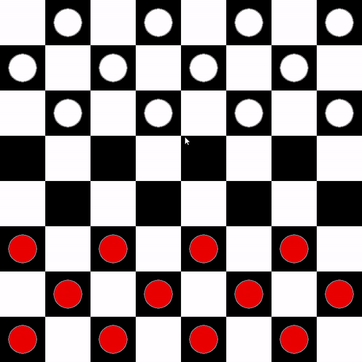

A checkers game built in Python using the Pygame modules.





**Usage**
---

```
Usage: main.py 

```


**Installation Options**
---

1. Install with [`pip`](https://pypi.org/project/stronghold/)
    + `$ python3 -m pip install -U pygame --user`

2. To see if it works, run one of the included examples:

    + `python3 -m pygame.examples.aliens`


**Upcoming**
---

```
Look forward for added AI !
So playing against the computer will be avaliable.

```


Hope you like you :)
